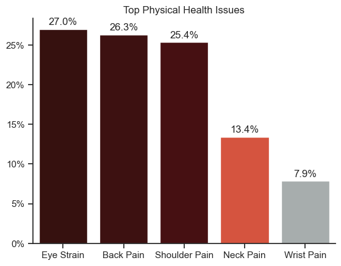
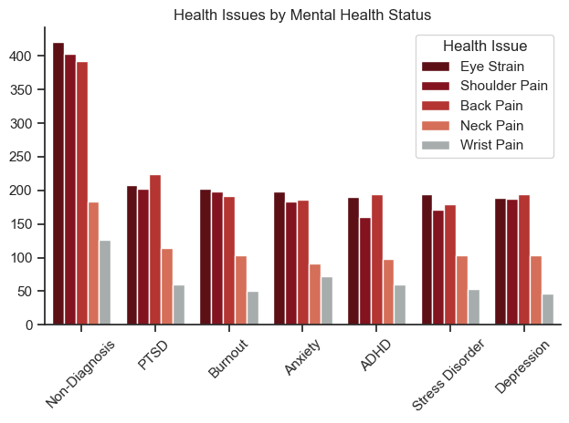
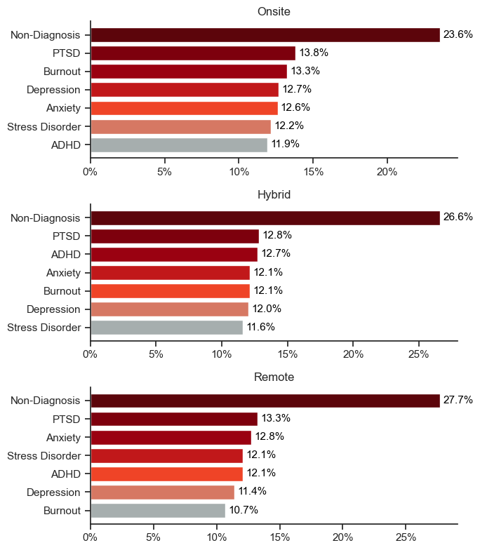
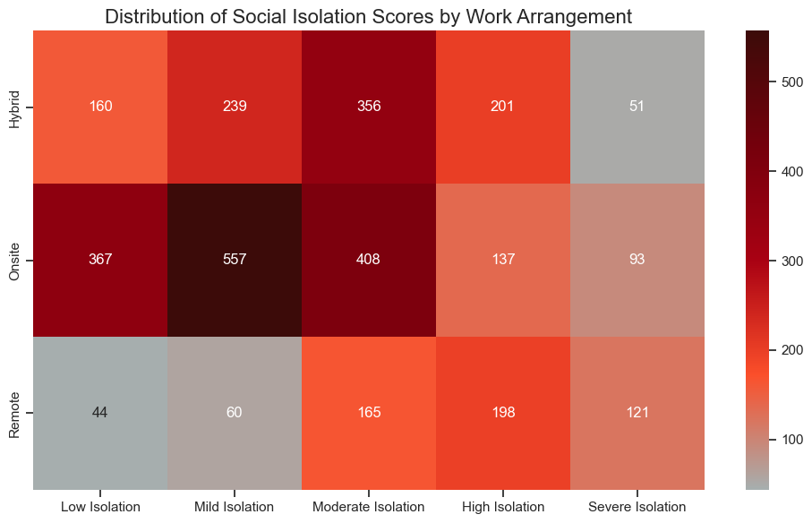
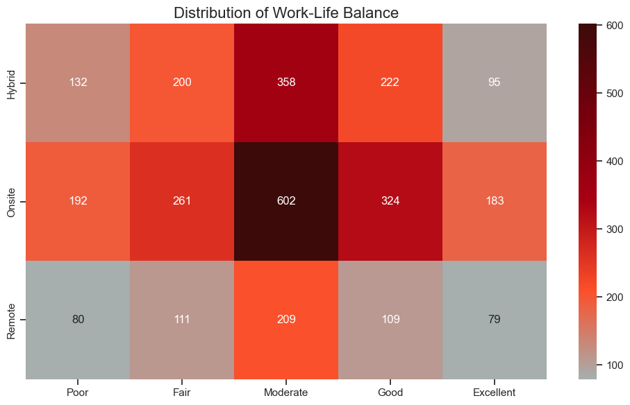
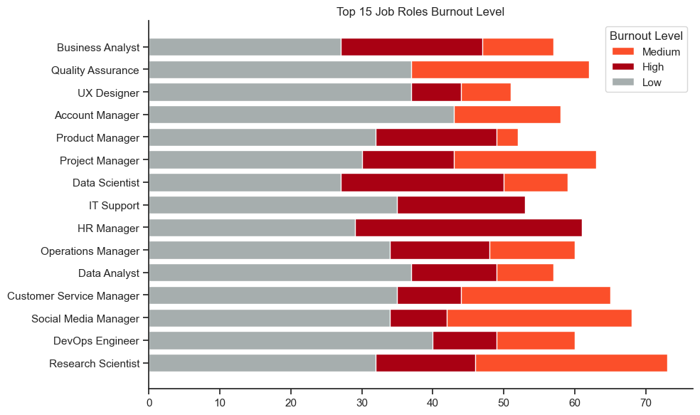

# The Analysis
## 1. What are the top health issues presented, and how do they relate to each mental health status?

To find the top health issues and how they relate to each mental health status, I exploded the health issues column to count each issue individually and added a column to calculate their percentages. To analyze the relationship between mental health status and physical health issues, I grouped the data accordingly.

View the detailed steps in my notebook: [2_Health_Issues.ipynb](2_Health_Issues.ipynb)

### Visualize Data

```python
sns.set_theme(style='ticks')
sns.barplot(data=top_health_issues, x='Health_Issue', y='percentage', hue='percentage', palette=smooth_cmap)
for i, text in enumerate(top_health_issues['percentage']):
    plt.text(i, text + 0.5, f'{text:.1f}%', ha='center')
```
*The percentage of each Health Issue*


```python
sns.set_theme(style='ticks')
n_categories = grouped_plot['Health_Issue'].nunique()
discrete_palette = [to_hex(smooth_cmap(i / n_categories)) for i in range(n_categories)]
sns.barplot(data=grouped_plot, x='Mental_Health', y='count', hue='Health_Issue', palette=discrete_palette[::-1])
``` 
*Health status with related health issues*

### Results


*Top Health Issues and their percentage*


*Mental health status with their associated physical issues*

### Insights
* `Eye strain` is the most presented health issue with a 27% followed by `back pain` (26.3%), the symptoms are associated with screen exposure and prolonged sitting.
* The highest health issues presented in each mental health status are `Eye Strain`,`Back pain`, and `Shoulder pain`, even among non-diagnosed individuals, these are the most commonly reported symptoms.


## 2. What mental health status are associated with the different job arrangements?
To analyze the mental health status across different work arrangements, I've grouped mental status with each modality and then added a new column to place the percentage of each mental status.

View the detailed steps in my notebook: [3_Work_Arrangement.ipynb](3_Work_Arrangement.ipynb)


### Visualize Data

```python
for i, title in enumerate(work_arrangements):
    data = df_merged[df_merged['Work_Arrangement'] == title].sort_values(by='Percentage', ascending=False)
    graph = (ax[i].barh(data['Mental_Health_Status'],
               data['Percentage'],
               color=get_color_palette(smooth_cmap, len(data['Mental_Health_Status']))[::-1]))
    ax[i].set_title(title)

```

### Results


### Insights
* `Non-Diagnosis` is the top status for each work arrangement which means that these individuals don't have any mental health condition.
* Even if `Non-Diagnosis` is the top for each work arrangement, 76% of `Onsite`, 73% of `Hybrid`, and 72% of `Remote` workers report mental health conditions, making them the majority over non-diagnosed individuals.
* While mild mental health conditions represent the largest share for each modality, `remote work` positions show slightly lower levels of mental health conditions compared to other modalities.

## 3. What is the impact of each work arrangement on work-life balance?
To answer the question I used the values of isolation and work-life balance to create heatmaps and visualize the connection between each work arrangement with the previous mentioned scales.

View the detailed steps in my notebook: [3_Work_Arrangement.ipynb](3_Work_Arrangement.ipynb)

### Visualize Data

```python
# Isolation plot
plt.figure(figsize=(10, 6))
sns.heatmap(social_life_pivot, annot=True, cmap=smooth_cmap, fmt='g')

# Work-life balance plot
plt.figure(figsize=(10, 6))
sns.heatmap(life_balance_pivot, annot=True, cmap=smooth_cmap, fmt='g')

```

### Results

*Heatmap of distribution of Social Isolation scores by each work arrangement*


*Heatmap of distribution of work-life balance scores by each work arrangement*
### Insights
* `Mild Isolation` and `Moderate Isolation` contain the average highest for each work arrangement, the lowest isolation values come from `onsite work` followed by `hybrid modality`, however for `remote positions` the isolation scores are higher than the others.
* A `Moderate work-life balance` contains the highest values for each work arrangement and it's followed by a `Good work-life balance`, while both extremes (`Poor` and `Excellent`) show the lowest values, which means that the balance needs to improve to reach a higher level (`Good` and `Excellent`).
* The social Isolation scores show that those work arrangements that allow people to keep in contact through work present the lowest rates.

## 4. What is the relationship between job role and mental health?
To answer this question, I analyzed burnout levels by job role. I extracted the top job roles and created a combined visualization to represent the different scores in a single bar.

View the detailed steps in my notebook: [4_Job_Roles.ipynb](4_Job_Roles.ipynb)

### Visualize Data

```python
bottom = [0] * len(role_burnout_pivot)

burnout_levels = ['Medium','High','Low']
burnout_colors = {
    'Low': '#A6AEAE',
    'Medium': '#FB4F2A',
    'High': '#A90113'
}

for level in burnout_levels:
    plt.barh(role_burnout_pivot.index, role_burnout_pivot[level], color=burnout_colors[level], label=level)
    bottom = [i + j for i, j in zip(bottom, role_burnout_pivot[level])]
```

### Results


### Insights
* While a `Low` burnout level is the biggest part for each one of the top roles, the combined total of `medium` and `high` burnout levels exceeds that of `Low` score.
* Management positions along with the scientific ones present a higher average of a `Medium` and `High` burnout levels.

# Conclusion
The analysis reveals that eye strain and back pain are the most common physical health issues across all mental health statuses. While non-diagnosed individuals make up the largest group in each work arrangement, a significant portion still experiences mental health challenges.

Remote work shows slightly lower mental health risk but comes with higher isolation levels, while onsite and hybrid roles offer better social interaction, yet sill present more stress indicators. Additionally, management and scientific roles report higher burnout rates, suggesting a need for targeted support based on role and work modality.
